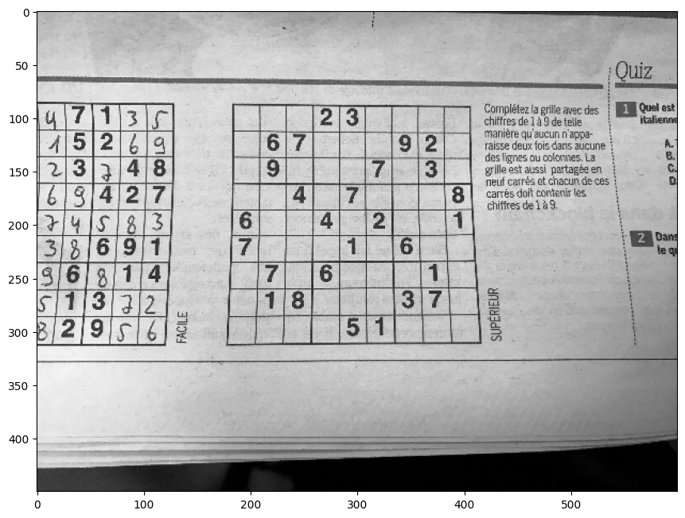
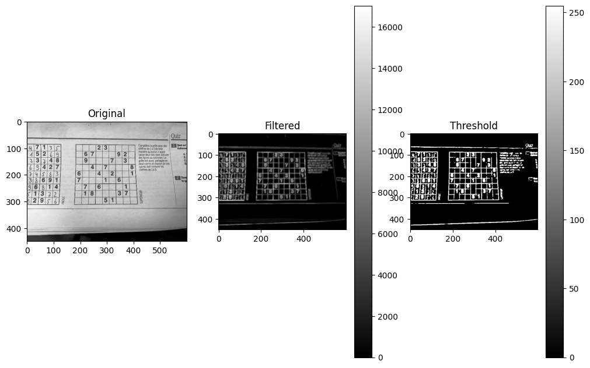
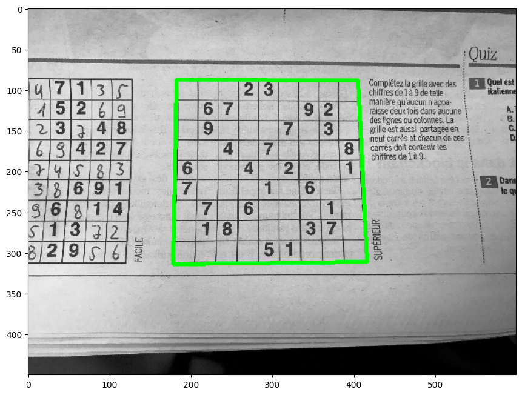
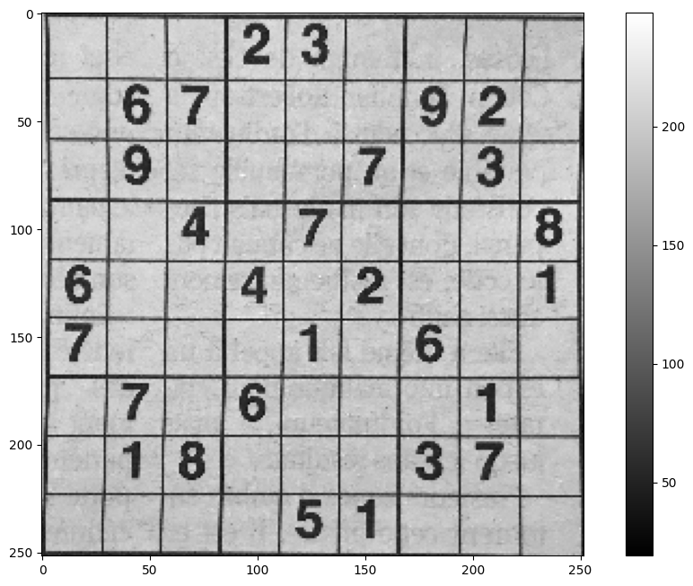
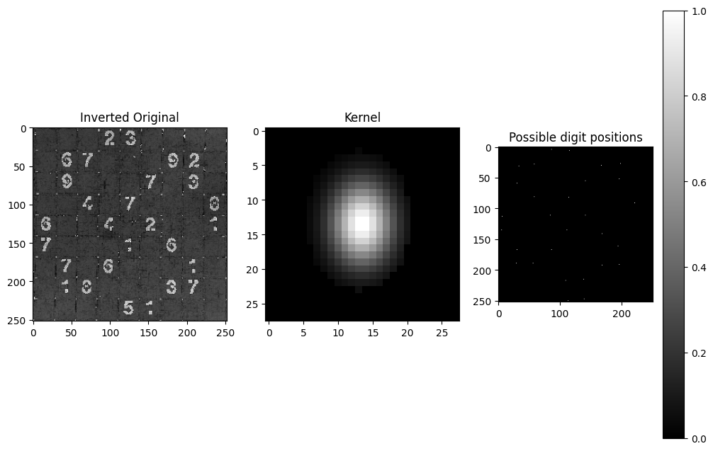
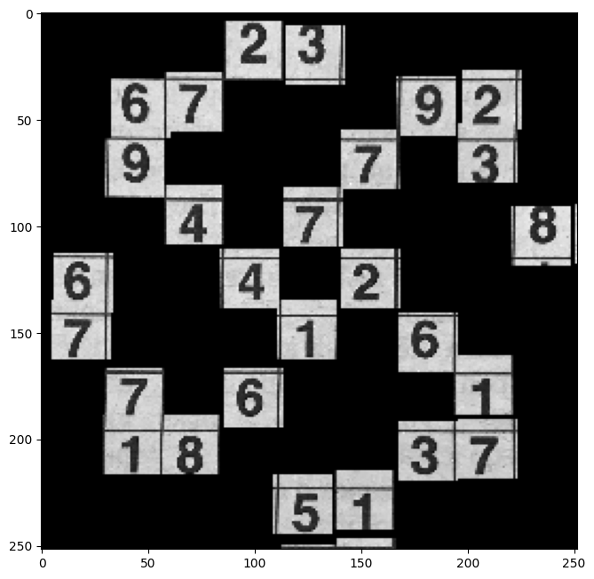

.. code:: ipython3

    import cv2 as cv
    import numpy as np
    import matplotlib
    import matplotlib.pyplot as plt
    from numba import jit
    plt.rc('image', cmap='gray')
    plt.rcParams['figure.figsize'] = [12, 8]
    plt.rcParams['figure.dpi'] = 100

First Step (Initalitization)
~~~~~~~~~~~~~~~~~~~~~~~~~~~~

-  Loading an Image
-  Conveting it to BW
-  Scale it to 600px width\*

\*asumption: Possible Pictures will have a roughly equal distance to the Grid
                                                                             

.. code:: ipython3

    Org=cv.imread("Samples/2.jpg")
    #Org=cv.imread("Samples/wichtounet/v2_test/image1088.jpg")
    Org_Color=Org
    Org=cv.resize(Org,(600,round(Org.shape[0]/Org.shape[1]*600)))
    Org=cv.cvtColor(Org,cv.COLOR_RGB2GRAY)
    Org=Org-np.min(Org)
    plt.imshow(Org)

.. parsed-literal::

    <matplotlib.image.AxesImage at 0x7f569152e310>

.. code:: ipython3

    
    def variance_filter(I, n=7):
        #I=np.array(I,dtype=np.float)
        
        result=np.zeros(I.shape)
        
        
        mean=np.array(cv.GaussianBlur(I,(n,n),1,1),dtype=np.float)
        return variance_filter_jit(I,mean,n)
        
        
             
    @jit(nopython=True)
    def variance_filter_jit(I,mean,n):
        h,w=I.shape
        result=mean
        for y in range(h):
            for x in range(w):
                
                sum=0
                for i in range(-n//2,n//2+1):
                    for j in range(-n//2,n//2+1):
                        
                        xi,yi=x+i,y+j   
                        sum+=(I[yi,xi]-result[y,x])*(I[yi,xi]-result[y,x])\
                              if xi>0 and yi>0 and yi<h and xi<w else 0
                
                result[y,x]=sum/(n**2-1)           
        return result   

Second Step (Reducing Noise)
~~~~~~~~~~~~~~~~~~~~~~~~~~~~

-  Inverting the Original
-  Using the variance to filter noisy regions from the image (i.e. text)
-  Thresholding the result

.. code:: ipython3

    
    I=np.copy(Org)
    I_var=variance_filter(I,5)
    I=cv.bitwise_not(I)*I_var
    I=I/np.max(I)*255
    I=np.array(I,dtype=np.uint8)
    I=cv.GaussianBlur(I,(3,3),5)
    #I= cv.adaptiveThreshold(I,255,cv.ADAPTIVE_THRESH_GAUSSIAN_C,cv.THRESH_BINARY_INV,11,2)
    I = cv.threshold(I,0,255,cv.THRESH_BINARY+cv.THRESH_OTSU)[1]
    #I=cv.Canny(I,50,150,apertureSize = 3)
    plt.subplot(131)
    plt.imshow(Org)
    plt.title("Original")
    plt.subplot(132)
    plt.imshow(I_var)
    plt.title("Filtered")
    plt.colorbar()
    plt.subplot(133)
    plt.imshow(I)
    plt.title("Threshold")
    plt.colorbar()
    plt.show()

Third Step (Aproximating the region of interest)
~~~~~~~~~~~~~~~~~~~~~~~~~~~~~~~~~~~~~~~~~~~~~~~~

-  Searching the biggest contour
-  Using this contour for a perspective transform

.. code:: ipython3

    I_Contour=np.copy(Org)
    I_Contour=cv.cvtColor(I_Contour,cv.COLOR_GRAY2RGB)
    contours, hierarchy = cv.findContours(I,cv.RETR_EXTERNAL, cv.CHAIN_APPROX_SIMPLE)
    
    # Find the index of the largest contour and aprox. it
    areas = [cv.contourArea(c) for c in contours]
    max_index = np.argmax(areas)
    cnt=contours[max_index]
    epsilon = 0.1*cv.arcLength(cnt,True)
    approx = cv.approxPolyDP(cnt,epsilon,True)
    cv.drawContours(I_Contour, [approx], -1, (0, 255, 0), 3)
    
    
    
    plt.imshow(I_Contour)

.. parsed-literal::

    <matplotlib.image.AxesImage at 0x7f568c3bddc0>

.. code:: ipython3

    ROI=np.copy(Org_Color)
    ROI=cv.cvtColor(ROI,cv.COLOR_RGB2GRAY)
    h,w=ROI.shape
    h_old,w_old=Org.shape
    pts_src=approx.flatten()
    print(pts_src)
    for i in range(len(pts_src)):
        if i%2:
            pts_src[i]=pts_src[i]*h/h_old
        else:
            pts_src[i]=pts_src[i]*w/w_old
    print(pts_src)
    #pts_dst = np.float32([[15,15],[15,165],[165, 15],[165, 165]])
    pts_dst = np.float32([[0,0],[0,252],[252, 0],[252, 252]])
    pts_src=np.float32([[pts_src[0],pts_src[1]],[pts_src[2],pts_src[3]],[pts_src[6], pts_src[7]],[pts_src[4], pts_src[5]]])
    trans = cv.getPerspectiveTransform(pts_src, pts_dst)
    #ROI = cv.warpPerspective(ROI, trans, (180,180))
    ROI = cv.warpPerspective(ROI, trans, (252,252))
    plt.imshow(ROI)
    plt.colorbar()

.. parsed-literal::

    [182  87 178 314 416 311 405  88]
    [1223  584 1196 2110 2795 2089 2721  591]

.. parsed-literal::

    <matplotlib.colorbar.Colorbar at 0x7f568c4f3340>

Fourth Step (Finding possible Digits)
^^^^^^^^^^^^^^^^^^^^^^^^^^^^^^^^^^^^^

-  Inverting the image
-  Creating an elongated ellipse kernel in the size of possible digits
-  Using the kernel convolution to find possible positions
-  Further imporvement of the result by non max supression and
   thresholding

.. code:: ipython3

    h,w=ROI.shape
    possible_digits=[]
    ROI=ROI-np.min(ROI)
    digits=ROI\
            -cv.dilate(ROI,cv.getStructuringElement(cv.MORPH_RECT,(11,1)))\
            -cv.dilate(ROI,cv.getStructuringElement(cv.MORPH_RECT,(1,11)))
    
    #kernel creation
    kernel=np.zeros((28,28))
    kernel[3:24,6:21]=cv.getStructuringElement(cv.MORPH_ELLIPSE,(15,21))
    kernel*=np.dot(cv.getGaussianKernel(28,4),cv.getGaussianKernel(28,3).T)
    kernel/=np.sum(kernel)
    
    kernel2=np.dot(cv.getGaussianKernel(28,5),cv.getGaussianKernel(28,4).T)
    kernel2[3:24,6:21]=0
    kernel2/=np.sum(kernel2)
    kernel2-=np.ones((28,28))
    kernel2/=np.sum(abs(kernel2))
    kernel=kernel+kernel2
    
    #Convolution (anchor point=(0,0) --> shifted by (10,10)
    img=cv.filter2D(digits,ddepth=cv.CV_32F,kernel=kernel,anchor=(0,0))
    
    #Non max supression in a 20x20 region
    max=cv.dilate(img,np.ones((28,28)))
    
    #Thresholding
    max=img==max
    thr=img>15
    max=thr*max
    
    plt.subplot(131)
    plt.imshow(digits)
    plt.title("Inverted Original")
    plt.subplot(132)
    plt.title("Kernel")
    plt.imshow(kernel)
    plt.subplot(133)
    plt.title("Possible digit positions")
    plt.imshow(max)
    plt.colorbar()
    print(np.sum(max))
    
                

.. parsed-literal::

    30

.. code:: ipython3

    possible_digits=np.zeros(ROI.shape)
    for i in range(h):
        for j in range(w):
            if max[i,j]:
                possible_digits[i:i+28,j:j+28]=ROI[i:i+28,j:j+28]
    plt.imshow(possible_digits)
        

.. parsed-literal::

    <matplotlib.image.AxesImage at 0x7f568c73fbe0>

